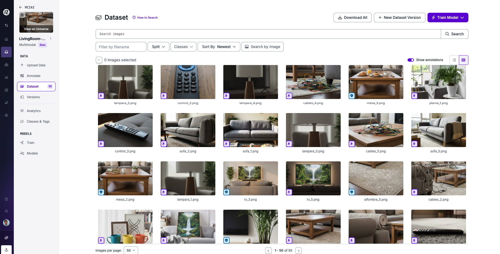
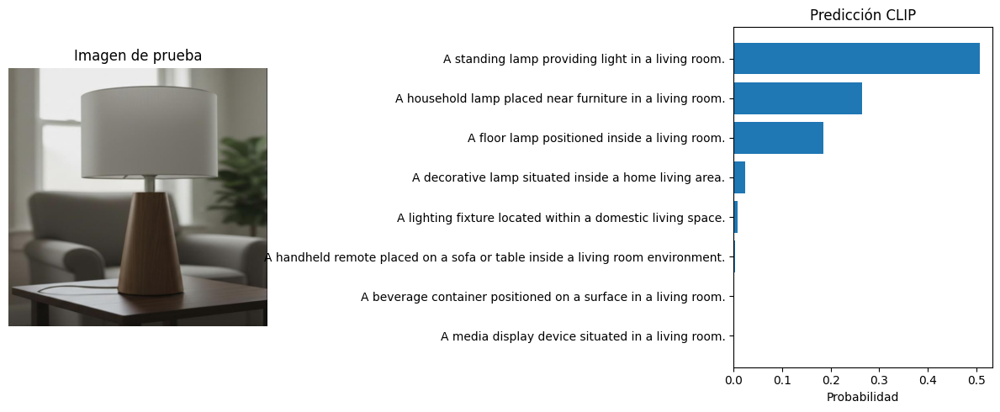
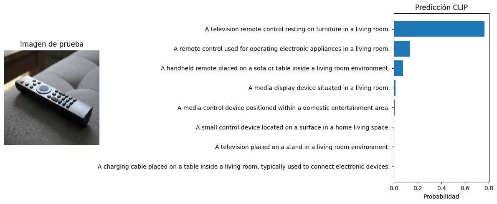
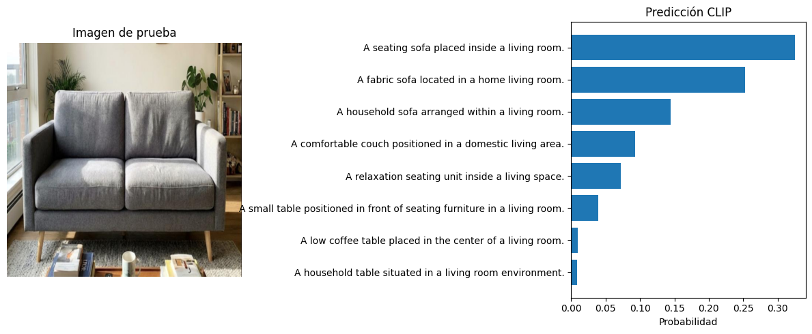
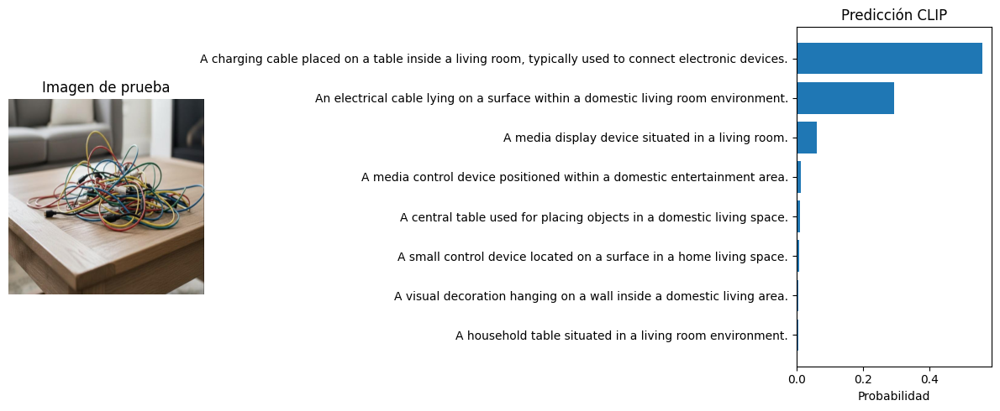

# Laboratorio 3 – Clasificación Zero-Shot de Objetos Domésticos con CLIP

[](https://github.com/mc-ivan/zero-shot/blob/main/lab3/notebooks/Practica3_Grupo3.ipynb)

## Grupo 3
- Ivan Mamani  
- Yesica Luna  
- Elvis Miranda  

---

Este laboratorio explora la **clasificación automática de objetos domésticos** utilizando un enfoque de **Zero-Shot Learning** basado en el modelo multimodal **CLIP (Contrastive Language–Image Pretraining)**.

A diferencia de enfoques tradicionales que requieren entrenamiento supervisado y grandes volúmenes de datos anotados, en este trabajo se implementa un sistema capaz de **identificar objetos presentes en imágenes sin haber sido entrenado previamente sobre esas clases**.

El experimento se enmarca dentro de un escenario aplicado a domótica, donde se busca construir un **inventario visual de objetos del hogar** a partir de imágenes reales capturadas con un dispositivo móvil (iPhone X).


## Objetivos

- Implementar clasificación **Zero-Shot** utilizando CLIP.
- Construir un **dataset personalizado** de objetos domésticos.
- Utilizar **Roboflow** para organización y gestión de datos.
- Definir un catálogo de objetos mediante **prompts textuales**.
- Calcular similitudes imagen-texto.
- Generar probabilidades interpretables mediante softmax.
- Visualizar resultados de clasificación.
- Evaluar la viabilidad del enfoque para inventario doméstico.

## Contenido del repositorio
```
lab3/
├── notebooks
│ ├── Laboratorio3-Informe-Grupo3.pdf
│ └── Practica3_Grupo3.ipynb
└── sources
├── images
│ ├── alfombra_1.png
│ ├── cables_1.png
│ ├── control_1.png
│ ├── cuadro_1.png
│ ├── lampara_1.png
│ ├── libro_1.png
│ ├── mesa_1.png
│ ├── planta_1.png
│ ├── sofa_1.png
│ ├── taza_1.png
│ ├── tv_1.png
│ └── ...
└── results
├── dataset-roboflow.png
├── prueba1.png
├── prueba2.png
├── prueba3.png
├── prueba4.png
└── prueba5.png
```

## Descripción de carpetas

- `notebooks/`  
  Contiene el notebook con toda la implementación del pipeline Zero-Shot con CLIP y el informe final del laboratorio.

- `sources/images/`  
  Incluye el dataset personalizado compuesto por imágenes de objetos domésticos capturadas manualmente.

- `sources/results/`  
  Contiene visualizaciones del dataset en Roboflow y resultados de inferencia del modelo CLIP.

## Dataset Personalizado

El dataset fue construido manualmente a partir de imágenes capturadas con un **iPhone X** en un entorno doméstico real (sala).

Incluye objetos como:

- Sofá  
- Mesa  
- TV  
- Plantas  
- Lámparas  
- Libros  
- Cables  
- Alfombra  
- Cuadros  
- Tazas  
- Control remoto  

Las imágenes fueron organizadas y gestionadas mediante Roboflow.

🔗 Dataset en Roboflow:  
https://app.roboflow.com/mciai/livingroom-catalog/1

Ejemplo del dataset:



## Resultados y visualizaciones

| Resultado | Descripción | Imagen |
|---------|-------------|--------|
| Prueba 1 | Clasificación Zero-Shot mediante similitud imagen-texto (lampara). |  |
| Prueba 2 | Predicción del objeto con mayor probabilidad (control remoto). |  |
| Prueba 3 | Interpretación de probabilidades del modelo CLIP (sofa). |  |
| Prueba 4 | Visualización del Top-K de predicciones (cuadro decorativo). |  |
| Prueba 5 | Inventario estimado del ambiente (cables). |  |

## Notebook del laboratorio

El notebook incluye:

- Lectura de anotaciones desde Roboflow
- Definición de prompts
- Cálculo de similitud imagen-texto
- Clasificación Zero-Shot
- Visualización de probabilidades
- Interpretación de resultados

**Notebook:**  
[](https://github.com/mc-ivan/zero-shot/blob/main/lab3/notebooks/Practica3_Grupo3.ipynb)

## Informe de laboratorio

**Informe de Laboratorio:**  
[Informe](/lab3/notebooks/Laboratorio3-Informe-Grupo3.pdf)

