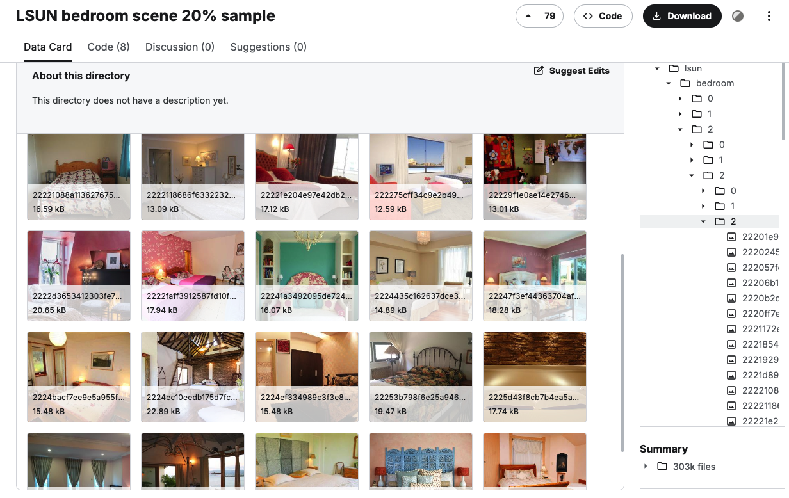
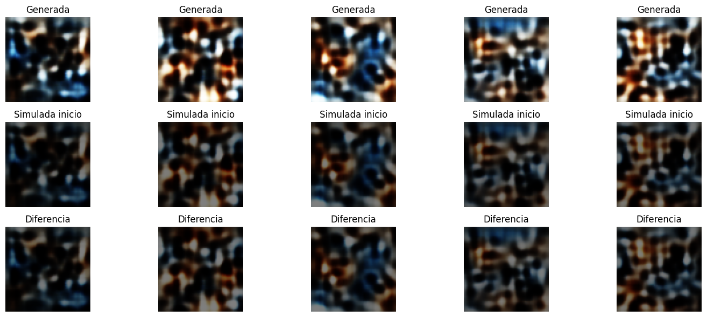
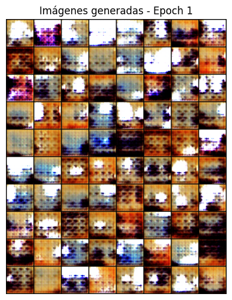
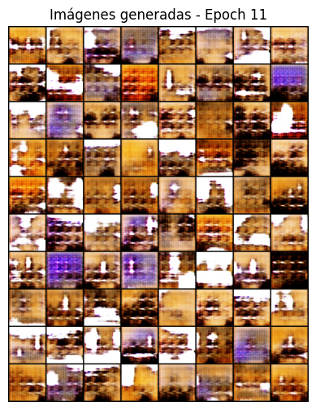
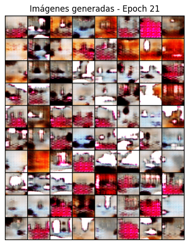
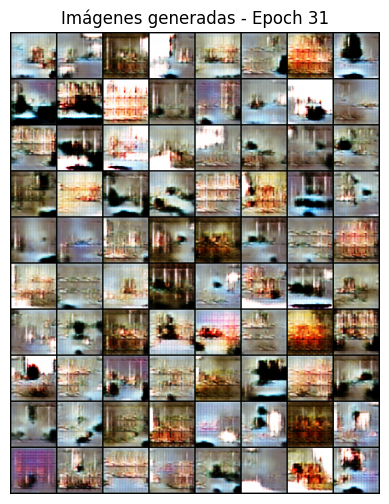
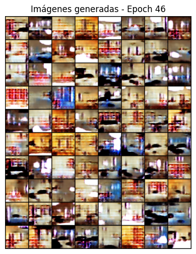

# Laboratorio 4 – Modelos Generativos: VAE vs GAN

VAE: [](https://github.com/mc-ivan/zero-shot/blob/main/lab4/notebooks/Practica4_Grupo3_VAE.ipynb)
GAN: [](https://github.com/mc-ivan/zero-shot/blob/main/lab4/notebooks/Practica4_Grupo3_GAN.ipynb)  


## Grupo 3
- Ivan Mamani  
- Yesica Luna  
- Elvis Miranda  

---

Este laboratorio explora la implementación y comparación de **Modelos Generativos Profundos**, específicamente:

- **GAN (Generative Adversarial Network)**
- **VAE (Variational Autoencoder)**

El objetivo principal es analizar el comportamiento de ambas arquitecturas en la generación de imágenes sintéticas, observando su evolución durante el entrenamiento y comparando la calidad visual obtenida.

## Objetivos

- Implementar una **GAN** desde cero.
- Implementar un **VAE** desde cero.
- Analizar la evolución de imágenes generadas por épocas.
- Comparar calidad visual entre ambos modelos.
- Interpretar diferencias arquitectónicas y resultados obtenidos.

## Contenido del repositorio
```
lab4/
├── notebooks
│ ├── Laboratorio4-Informe-Grupo3.pdf
│ ├── Practica4_Grupo3_GAN.ipynb
│ └── Practica4_Grupo3_VAE.ipynb
├── README.md
└── sources
├── dataset-kaggle.png
├── GAN-epoch1.png
├── GAN-epoch11.png
├── GAN-epoch21.png
├── GAN-epoch31.png
├── GAN-epoch46.png
├── GAN-resultado-prueba.png
├── VAE-diferencias.png
└── VAE-resultado-prueba.png
```

## Descripción de carpetas

- `notebooks/`  
  Contiene los notebooks completos de implementación de GAN y VAE, además del informe final del laboratorio.

- `sources/`  
  Incluye capturas del dataset utilizado y resultados visuales generados durante el entrenamiento.

## Dataset utilizado

El dataset fue obtenido desde Kaggle y preprocesado para su uso en modelos generativos.

Dataset: https://www.kaggle.com/datasets/jhoward/lsun_bedroom/data



# Modelo 1: VAE

El VAE está compuesto por:

- Encoder  
- Espacio latente probabilístico  
- Decoder  
- Función de pérdida: reconstrucción + Divergencia KL  

## Resultado generado


## Comparación inicial vs final



### Observaciones

- Las imágenes presentan mayor suavizado.
- Menor definición en comparación con GAN.
- Entrenamiento más estable.
- No se incrementaron significativamente los epochs debido a:
  - Alta demanda computacional.
  - Saturación del límite de GPU en Google Colab.
  - Interrupción del entrenamiento al intentar superar las 40 epochs.

# Modelo 2: GAN

La GAN está compuesta por:

- Generador  
- Discriminador  
- Entrenamiento adversarial conjunto  

Durante el entrenamiento se capturaron imágenes generadas en diferentes épocas para analizar la evolución.

## Evolución por épocas

| Época | Resultado |
|--------|------------|
| Epoch 1 |  |
| Epoch 11 |  |
| Epoch 21 |  |
| Epoch 31 |  |
| Epoch 46 |  |

### Observaciones

- Mejora progresiva en la reducción de ruido.
- Mayor definición de contornos.
- Mejor estructuración espacial.
- Imágenes más coherentes visualmente conforme avanzan las épocas.

Resultado final de prueba:


# Comparación General: GAN vs VAE

| Criterio | GAN | VAE |
|-----------|------|------|
| Calidad visual | Alta | Media |
| Nitidez | Mayor | Menor |
| Estabilidad del entrenamiento | Puede ser inestable | Más estable |
| Espacio latente | Implícito | Explícitamente regularizado |
| Costo computacional | Alto | Alto |
| Sensibilidad a epochs | Moderada | Alta |

## Notebooks del laboratorio

**GAN:**  
[Practica4_Grupo3_GAN.ipynb](https://github.com/mc-ivan/zero-shot/blob/main/lab4/notebooks/Practica4_Grupo3_GAN.ipynb)

**VAE:**  
[Practica4_Grupo3_VAE.ipynb](https://github.com/mc-ivan/zero-shot/blob/main/lab4/notebooks/Practica4_Grupo3_VAE.ipynb)


## Informe del laboratorio

**Informe de Laboratorio:**  
[Laboratorio4-Informe-Grupo3.pdf](lab4/notebooks/Laboratorio4-Informe-Grupo3.pdf)

## Conclusión General

La GAN demostró mayor capacidad para generar imágenes visualmente realistas en menor número de épocas gracias a su entrenamiento adversarial.  

El VAE, aunque matemáticamente más estable y con mejor estructuración del espacio latente, produjo imágenes más difusas debido a la regularización probabilística y a limitaciones computacionales durante el entrenamiento.

La elección entre ambos modelos dependerá del objetivo final:

- Realismo visual → **GAN**  
- Espacio latente estructurado y estabilidad → **VAE**


